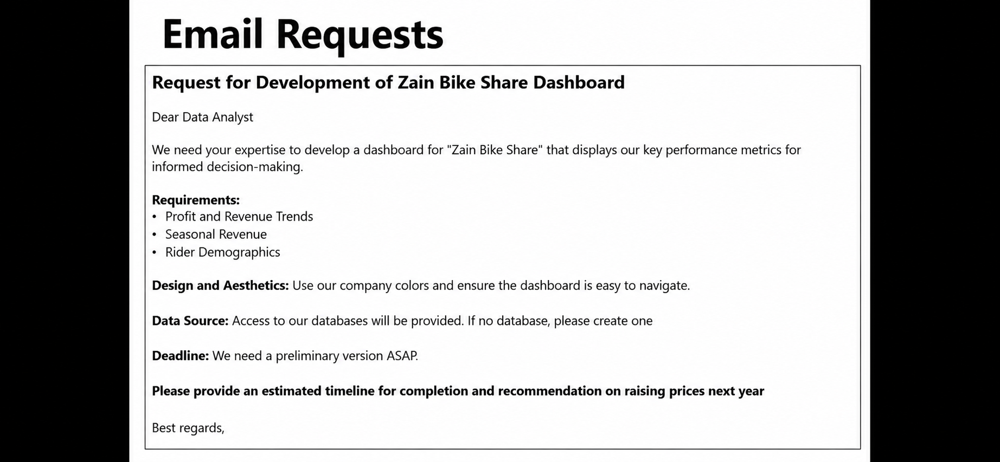
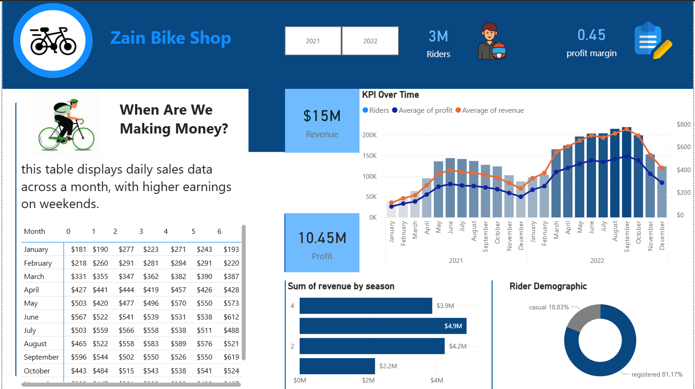

# Zain Bike Share Analysis Project

## Project Overview

This project analyzes historical bike-sharing data to provide actionable business insights. Using SQL for data processing and Power BI for visualization, the project focuses on revenue and profit trends, seasonal patterns, and rider behavior to guide strategic decisions.

## Business Request

The management requested an analysis of the bike-sharing business performance, specifically:

- Profit and revenue trends
- Seasonal and yearly revenue patterns
- Rider type analysis (casual vs registered)
- Recommendations for pricing strategy

## Tools Used

- SQL: Data extraction, cleaning, and calculations for revenue and profit
- Power BI: Dashboard visualization of trends and key metrics
- CSV Dataset: Historical bike-sharing data

## Project Process

### Step 1: Data Preparation

- Combined two years of bike-sharing data using a Common Table Expression (CTE)
- Merged with cost data to calculate accurate profit

### Step 2: SQL Analysis

- Selected key business metrics: date, season, year, weekday, rider type, riders, price, and COGS
- Calculated revenue (riders * price) and profit (riders * price - COGS)
- Joined tables to align cost and revenue data per year

### Step 3: Dashboard Visualization

- Built an interactive Power BI dashboard showing:
  - Revenue and profit trends by season and year
  - Distribution of riders by type
  - Seasonal patterns in business performance
- Highlighted top-performing months and customer segments

### Step 4: Insights

- Revenue increased compared to the previous year
- Registered riders contributed most of the stable revenue
- Seasonal trends affect rider demand and revenue

## Recommendations

1. Conservative Price Increase
   - Apply a 10–15% price increase to test market response without losing customers
   - Example: If current price is $4.99 → 10% increase = $5.49, 15% increase = $5.74

2. Segmented Pricing Strategy
   - Different pricing for casual vs registered riders to optimize revenue based on sensitivity

3. Monitor Customer Behavior
   - Track the impact of price changes to ensure revenue growth without losing loyalty

4. Focus on High-Performing Periods
   - Promote marketing during peak seasons identified in the dashboard

5. Inventory and Capacity Planning
   - Align bike availability with seasonal demand to improve service and maximize revenue

## Dashboard Preview

## Outcome

This project demonstrates the ability to:

- Extract, clean, and combine datasets using SQL
- Perform revenue and profit calculations for business insights
- Visualize key metrics in Power BI
- Provide actionable recommendations based on data

